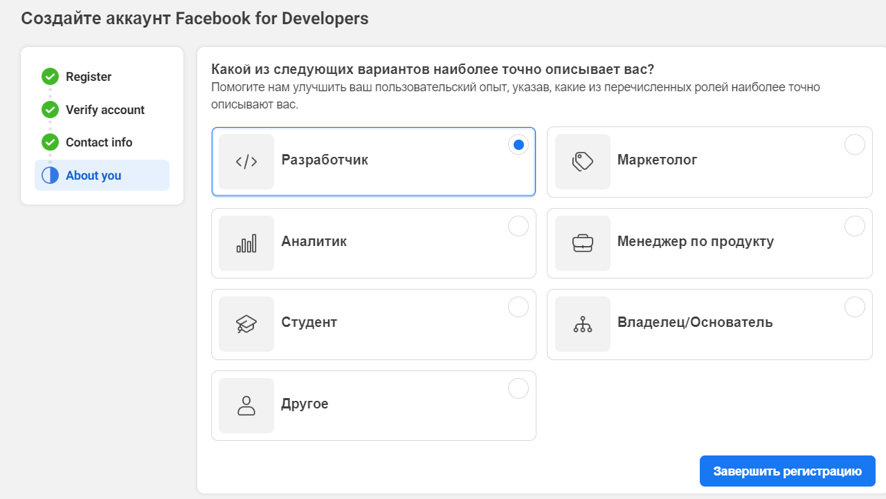

##  Создание проекта в Facebook

1. Перейти по ссылке https://developers.facebook.com
2. Перейти по ссылке “Начать работу” или ”MyApps” (в зависимости от локализации)

4. В окне приложений создайте приложение нажав на соответствующую кнопку

5. Выберите тип приложения “Consumer”/”Потребительское”  (в зависимости от локализации).

6. Введите название приложения (остальные поля по желанию) и создайте приложение (зеленая кнопка)

7. После создания приложения, сайт перенаправит на страницу с добавления продуктов. Выберите “Set up”/”Настроить” для “Facebook login”/”Вход через facebook”

8. В следующем окне перейдите во вкладку “Настроек”

9. В поле “Действительные URI перенаправления для OAuth”/”Valid OAuth redirect URLs” ввести “https://test.service.assetdata.market/signin-facebook” и “https://test.service.assetdata.market/api/identity/externalAuth/auth-client-redirect”  (без кавычек). Сохраните изменения.

10. Во вкладке Настройки(“Settings”) -> Основные(“Basics”). Значения полей AppId(id приложения) и App secret (секрет приложения) определить в настройках web(server-side) приложения.

11. Возможно потребуется заполнить такие поля как: URL-адрес политики конфиденциальности и url удаления данных пользователей

