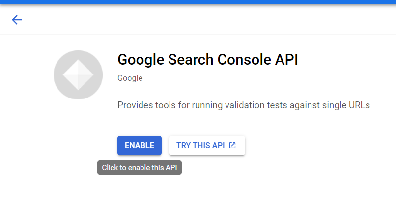

##  Создание проекта в Google Cloud

1. Переходим и авторизовываемся https://console.cloud.google.com/projectcreate?pli=1

2. Создаем проект, присваиваем название
3. Пишем в поиске "Library" и переходим на ссылку вида https://console.cloud.google.com/apis/library?project=testproject-309209&supportedpurview=project

4. Далее ищем "Google Search Console API" и включаем его

5. Далее переходим на вкладку "Credentials", это URL вида: https://console.cloud.google.com/apis/credentials?project=testproject-309209&folder=&organizationId=

6. Нажимаем кнопку "Create Credentials" и выбераем «OAuth Client ID»
7. Далее нажимаем кнопку "Configure Consent Screen"
8. Выбираем пункт "External" и нажимаем "Create"
9. В Appname указываем что удобно, в саппорт Email указываем ваш email
10. Соглашаемся далее со всеми пунктами
11. Далее снова переходим в раздел "Credentials"
12. Снова нажимаем кнопку "Create Credentials" и выбераем «OAuth Client ID»

13. Выбираем уже в выпадающем списке "Web Application"

17. В поле Authorized redirect URIs добавить следующие адреса: https://service.assetdata.market/signin-google
https://test.service.assetdata.market/api/identity/externalAuth/auth-client-redirect 

15. Нажимаем кнопку "Create"
16. Скачиваем файл который появился в поле "OAuth 2.0 Client IDs"

