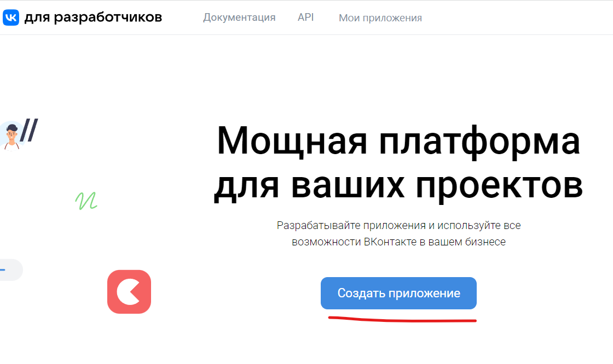
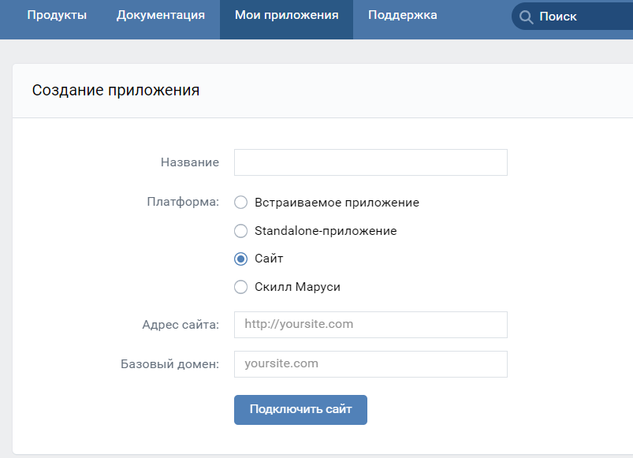
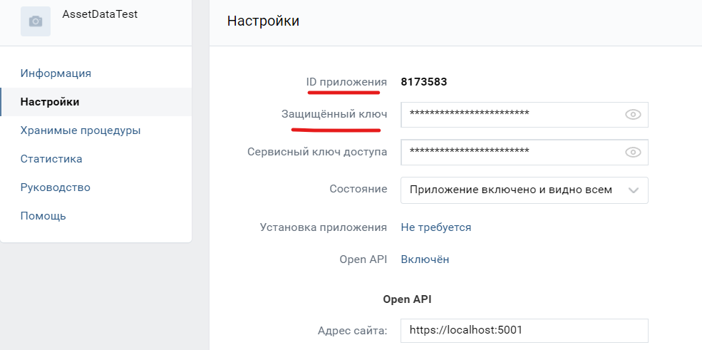
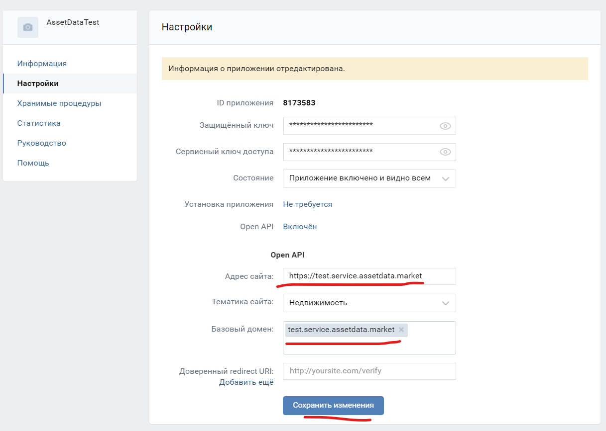

1. https://dev.vk.com/ 

2. Выбрать платформу “Сайт” и заполнить все поля:

3. Использовать Id приложения и Защищенный ключ

4. Указать Адрес сайта и базовый домен(возможно без https). B и сохранить изменения

5. Добавить следующие адреса в “Доверенные redirect URL” с нужным доменом:
https://test.service.assetdata.market/signin-vkontakte
https://test.service.assetdata.market/api/dentity/externalAuth/auth-client-redirect
